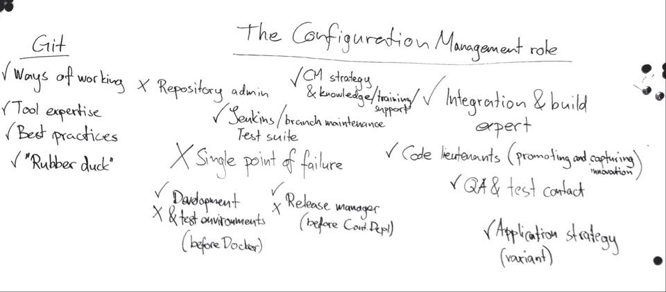

# The new Configuration Manager role 

## About

Some organizations have configuration manager (CM) role, some manage without it. For sure it is changing when you are moving to distributed version control (DVCS), but what are suitable responsibilities for this new CM role, and which should one move away from?

## Who is this branch for?

Configuration Managers or anyone interested in configuration management, development environments and enabling organizations to improve their development processes.

## Contributing

Input your comments and questions and send a pull request to [github user UncleCJ](https://github.com/UncleCJ/hicollegegit/compare/)!

## Resources

