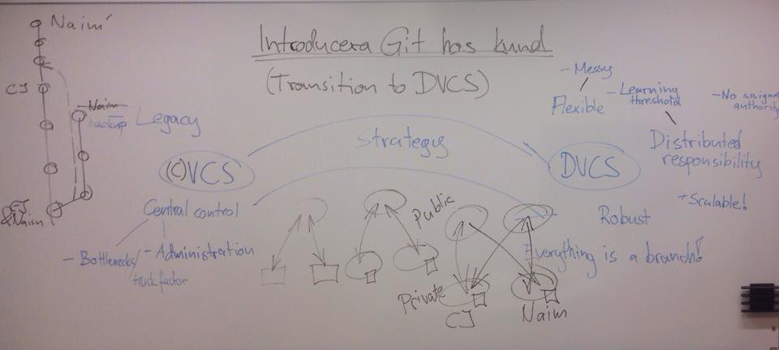

# How to transition an organization and development to Git

## About

Moving to Git (and thus distributed version control, DVCS) encompasses challenges, both technical and to the organization. Our impression is that the benefits of making this transition outweigh the drawbacks and challenges. This branch is about describing all those things in order to enable us bringing HiQ clients through that transition.

## Who is this branch for?

Intermediate and Configuration Management expert levels. Anyone interested in configuration management, development environments and enabling organizations to improve their development processes.

## Contributing

Input your comments and questions and send a pull request to [github user UncleCJ](https://github.com/UncleCJ/hicollegegit/compare/)!

## Resources

